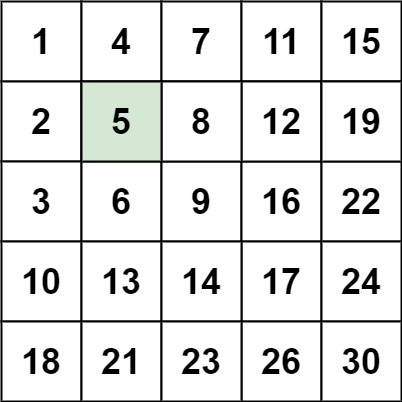

# Leetcode Question 240. Search a 2D Matrix II

**Question Description** 
Write an efficient algorithm that searches for a value target in an m x n integer matrix matrix. This matrix has the following properties:

- Integers in each row are sorted in ascending from left to right. 
- Integers in each column are sorted in ascending from top to bottom. 

**Test cases** 

**Input:** matrix = [[1,4,7,11,15],[2,5,8,12,19],[3,6,9,16,22],[10,13,14,17,24],[18,21,23,26,30]], target = 5  
**Output:** true  

**Approach** 
here we will operate on the 2D array as it creating pointers to cooridinate on it and operate this is the general way to work in a 2D array. This way work like following the search the biggest element of the row if it target is smaller search on the left of it otherwise go to the next row. 

**Time Complexity - O(log (n + m))  
Space Complexity - O(1)**
