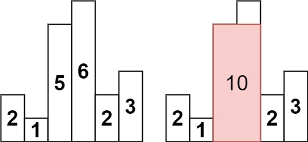

# Leetcode Question 84. Largest Rectangle in Histogram

**Question Description** 
Given an array of integers heights representing the histogram's bar height where the width of each bar is 1, return the area of the largest rectangle in the histogram. 

**Test cases** 
 
**Input:** heights = [2,1,5,6,2,3] 
**Output:** 10  
**Explanation:**  The above is a histogram where width of each bar is 1. 
The largest rectangle is shown in the red area, which has an area = 10 units.  

**Approach** 

**Largest Rectangle in Histogram (Optimal Stack-Based)**

This solution uses a stack-based approach to find, for each bar, its **previous smaller element (PSE)** and **next smaller element (NSE)** to the left and right.

**Core Idea:**
For each bar of height `h`:

* Find the nearest smaller bar to its left (PSE)
* Find the nearest smaller bar to its right (NSE)
* Width where this bar can extend = `NSE - PSE - 1`
* Area = `h × width`
* Track the maximum area

**Execution Breakdown:** 
**First Loop (traverse left to right):**

* When current bar is smaller than stack top, pop and calculate:
  * Height: the popped bar
  * NSE (next smaller): current index `i`
  * PSE (previous smaller): remaining stack top (or -1 if empty)
  * Area: `h × (i - pse - 1)`

**Second Loop (process remaining bars):**

* For bars still in stack (no NSE found):
  * NSE = `n` (end of array)
  * Calculate area the same way

**Time Complexity - O(n) AND actually 0(3n)  
Space Complexity - O(n)**
