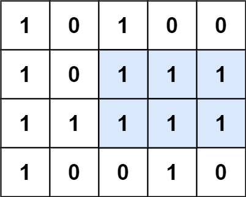

# Leetcode Question 85. Maximal Rectangle

## **IMP** Topic:the approach of monotonic stack,

**Question Description** 
Given a rows x cols binary matrix filled with 0's and 1's, find the largest rectangle containing only 1's and return its area.

**Test cases** 
 
**Input:** matrix = [["1","0","1","0","0"],["1","0","1","1","1"],["1","1","1","1","1"],["1","0","0","1","0"]] 
**Output:** 6  
**Explanation:**  The above is a histogram where width of each bar is 1. 
The largest rectangle is shown in the red area, which has an area = 6 units.  

**Approach** 

**Maximal Rectangle in Binary Matrix**

This solution combines two concepts:
 1. Histogram heights for each row
 2. Largest Rectangle in Histogram (stack-based)

**Core Idea:**
Step 1: Convert each row into a histogram::

* For each row, calculate height of consecutive '1's above (including current row)
* When cell is '0', height resets to 0; when '1', height increments

**Step 2: Find largest rectangle in each histogram**

* Apply the stack-based largestRectangleArea algorithm to each histogram

**Time Complexity - O(n) AND actually 0(3n)  
Space Complexity - O(n)**
